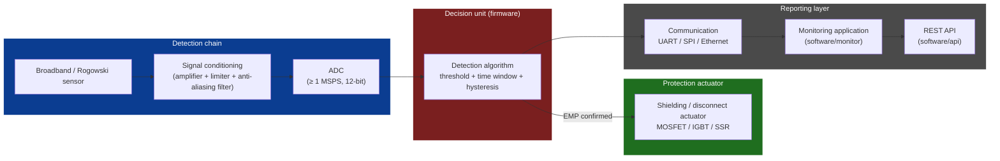
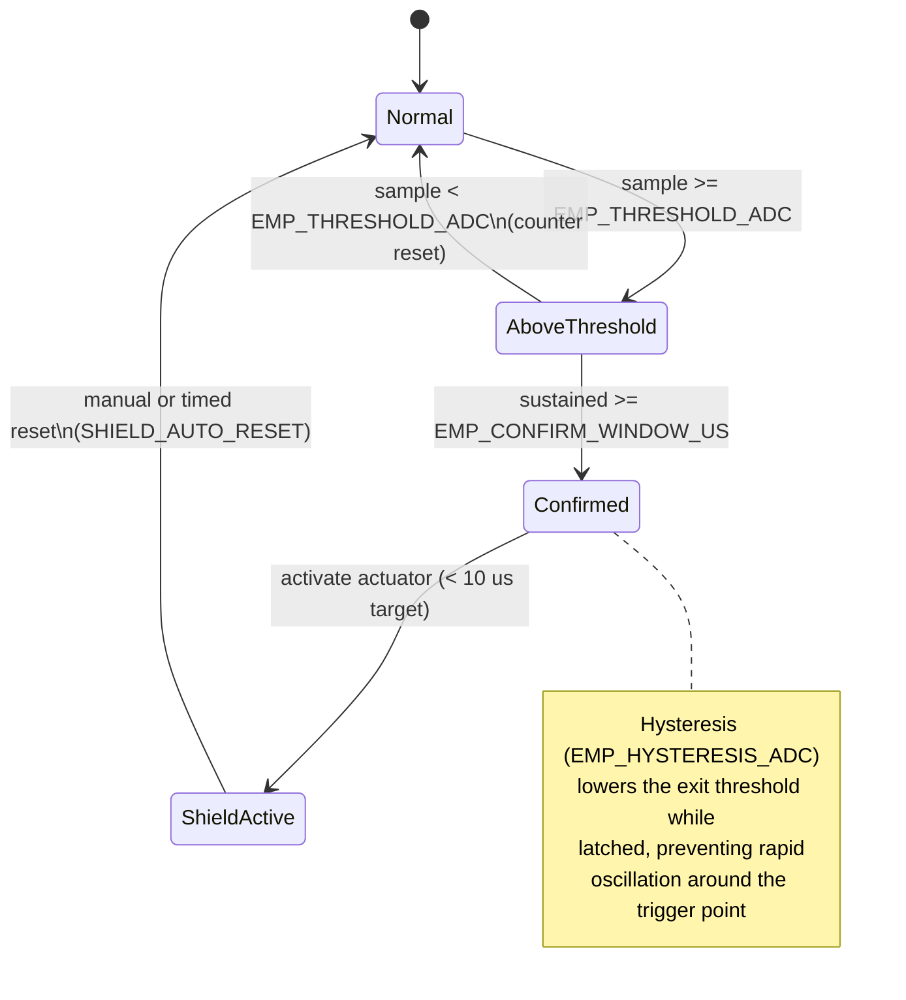
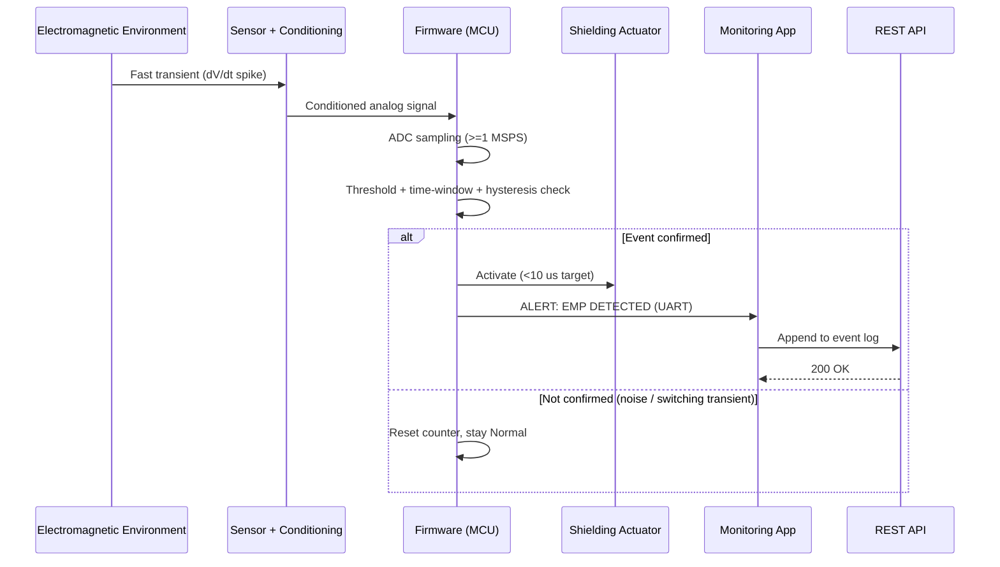

# EMP-Guardian


**Open-source embedded system for the detection and mitigation of electromagnetic pulse (EMP) effects on critical electronic equipment.**

**Author:** Ciprian Ștefan Pleșca — Independent Researcher, Romania
**License:** MIT (software) · CERN-OHL-S v2 (hardware) · CC BY-SA 4.0 (documentation)
**Status:** Open, work-in-progress project, released free of charge to the scientific and engineering community
**Cost to use:** Free. No paywall, no license fee, no registration.

> **Declared purpose:** this project is strictly **defensive**. It contains only detection, shielding, and protection mechanisms for electronics. It does not contain, describe, or promote any method for generating or amplifying an electromagnetic pulse. Any use must comply with applicable national and international law (electromagnetic compatibility regulations, dual-use export controls, etc.). See [`docs/threat_model.md`](docs/threat_model.md) and [`docs/compliance.md`](docs/compliance.md) for the full scope statement.

---

## Table of Contents

- [Why this project exists](#why-this-project-exists)
- [What the system does](#what-the-system-does)
- [System overview](#system-overview)
- [Repository structure](#repository-structure)
- [Quick start](#quick-start)
- [Documentation](#documentation)
- [Project status / epistemic honesty](#project-status--epistemic-honesty)
- [How to contribute](#how-to-contribute)
- [Support this research](#support-this-research)
- [Citation](#citation)
- [Author and acknowledgements](#author-and-acknowledgements)

---

## Why this project exists

An EMP event — whether natural (a Carrington-class geomagnetic storm) or of human origin (industrial electrostatic discharge, a high-power electromagnetic pulse encountered accidentally or through hostile action) — can instantly destroy unshielded electronics: power grids, communications, medical equipment, servers, vehicles.

EMP-Guardian is a fully documented, reproducible technical starting point for anyone who wants to build or study a protection system: independent researchers, institutions, engineers, and university teams — particularly those **without access to classified military standards or proprietary commercial solutions**.

## What the system does

1. **Detects** an anomalous electromagnetic event using a broadband sensor and an adaptive-threshold algorithm.
2. **Confirms** the event (rejects false positives from ordinary industrial switching transients or common RF interference).
3. **Activates** shielding/disconnection of the protected electronics within microseconds.
4. **Logs** the event and reports it through a monitoring application.

## System overview



### Detection decision logic



### End-to-end event sequence



## Repository structure

```
EMP-Guardian/
├── README.md
├── CHANGELOG.md
├── SUPPORT.md
├── MANIFESTO.md
├── DONATE.md
├── LICENSE
├── LICENSE-HARDWARE
├── CONTRIBUTING.md
├── CODE_OF_CONDUCT.md
├── SECURITY.md
├── CITATION.cff
├── .gitignore
├── .editorconfig
├── .github/
│   ├── dependabot.yml
│   ├── workflows/ci.yml
│   ├── ISSUE_TEMPLATE/
│   └── PULL_REQUEST_TEMPLATE.md
├── assets/
│   └── emp-guardian-cover.png
├── docs/
│   ├── architecture.md
│   ├── theory_of_operation.md
│   ├── hardware_specs.md
│   ├── threat_model.md
│   ├── test_procedures.md
│   ├── compliance.md
│   ├── user_manual.md
│   └── future_work.md
├── firmware/
│   ├── src/              # portable: app.c/h, emp_detector, shield_control, comms, config.h, main.c
│   ├── include/          # hal.h - the one contract every board port implements
│   ├── boards/           # per-board HAL implementations (stm32, rp2040, ...)
│   │   ├── stm32/
│   │   └── rp2040/
│   ├── tests/            # host-side unit tests (mocked HAL, no board SDK needed)
│   └── Makefile
├── software/
│   ├── monitor/
│   ├── api/
│   └── calculator/       # emp_calculator.py - skin depth, shielding SE, Rogowski, latency budget
├── hardware/
│   ├── schematics/
│   ├── pcb/gerber/
│   ├── enclosure/
│   └── bom.csv
├── simulation/
│   ├── spice/
│   └── models/
└── .github/workflows/ci.yml
```

## Quick start

Build the firmware (default board: STM32F4; `make BOARD=rp2040` targets the Pico SDK skeleton instead - see `firmware/boards/`):

```bash
cd firmware
make
st-flash write build/stm32/emp_guardian.bin 0x08000000
```

Run the firmware's host-side unit tests (no board, no cross-compiler required):

```bash
cd firmware
make test
```

Monitoring application (Python 3.9+):

```bash
cd software/monitor
pip install -r requirements.txt
python emp_monitor.py --port /dev/ttyUSB0
```

Engineering calculator (skin depth, shielding effectiveness, Rogowski sensor sensitivity, latency budget - see `software/calculator/README.md` for full details and honesty notes):

```bash
cd software/calculator
python3 emp_calculator.py shielding --freq 1e6 --thickness-mm 1.0 --material copper
python3 -m unittest test_emp_calculator.py -v
```

Detection circuit simulation (requires ngspice):

```bash
cd simulation/spice
ngspice emp_pulse_sim.sp
```

## Documentation

See the [`docs/`](docs/) directory for architecture, theory of operation, hardware specifications, threat model, test procedures, and legal/compliance considerations. See [`docs/future_work.md`](docs/future_work.md) for research directions under consideration (not yet implemented).

For how this project positions itself relative to existing literature and its academic motivation, see [`MANIFESTO.md`](MANIFESTO.md).

## Project status / epistemic honesty

This is an early-stage, open reference design — not a certified, lab-validated product. See [`MANIFESTO.md`](MANIFESTO.md) for the full epistemic-status statement. In short:

| Component | Status |
|---|---|
| Detection algorithm | Implemented, unit-tested with synthetic signals (no real hardware yet) |
| Threshold / hysteresis parameters | Initial design values, not experimentally calibrated |
| Hardware (schematic, PCB, enclosure) | Specification and BOM level, not validated manufacturing files |
| Lab measurements | None published in this repository yet |

## How to contribute

See [`CONTRIBUTING.md`](CONTRIBUTING.md). Any contribution — code, documentation, corrections, test data — must preserve the strictly defensive nature of the project.

## Support this research

EMP-Guardian is developed independently, with no institutional funding, by a researcher working without dedicated lab resources. If this project is useful to you and you'd like to help it progress toward real hardware validation, see [`DONATE.md`](DONATE.md).

## Citation

If you use this project in academic work, see [`CITATION.cff`](CITATION.cff).

## Author and acknowledgements

Project initiated and maintained by **Ciprian Ștefan Pleșca**, an independent researcher from Romania, published free of charge and without commercial intent, in support of open research and critical-infrastructure resilience.
