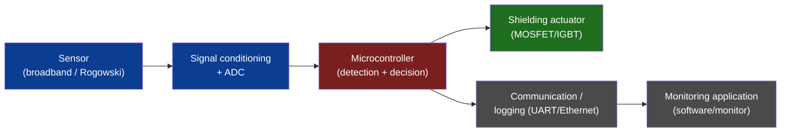
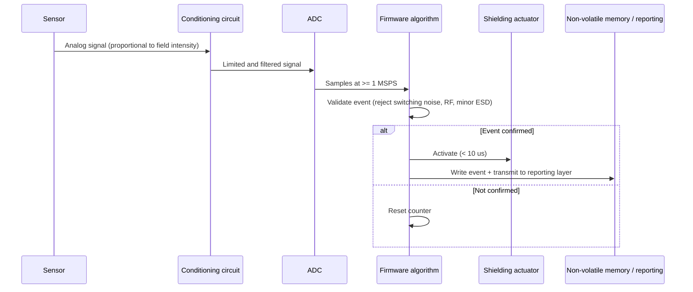

# EMP-Guardian Architecture

**Author:** Ciprian Ștefan Pleșca

## Overview

EMP-Guardian is composed of four subsystems working together:

1. **Detection chain** (sensor + signal conditioning + ADC)
2. **Decision unit** (firmware, detection algorithm)
3. **Protection actuator** (fast shielding/disconnection)
4. **Reporting layer** (communication, logging, remote monitoring)

## Components

- **EMP sensor:** Rogowski coil or broadband antenna, with a conditioning circuit (amplifier + voltage limiter, essential to protect the ADC input).
- **Microcontroller:** samples the signal, runs the detection algorithm (adaptive threshold + time window), and makes the activation decision.
- **Shielding actuator:** high-speed switches (MOSFET/IGBT or solid-state relays) that electrically isolate the protected equipment or route it to a controlled discharge path.
- **Communication interface:** UART, SPI, or Ethernet, for reporting to the monitoring application.
- **Backup power:** battery or supercapacitor, so the system remains functional during and immediately after the event.

## Data flow

1. The sensor produces an analog signal proportional to the intensity of the detected electromagnetic field.
2. The conditioning circuit limits and filters the signal before the ADC.
3. The ADC samples at a sufficiently high rate (minimum 1 MSPS) to capture fast edges.
4. The firmware algorithm validates the event (rejecting normal switching, RF noise, minor ESD).
5. If the event is confirmed, the actuator is activated in under 10 µs.
6. The event is written to non-volatile memory and transmitted to the reporting layer.

## Design principles

- **Fail-safe:** if the system loses power or malfunctions, the shielding must remain in (or transition to) the default protected state.
- **Minimal latency:** total detection-to-activation time is the critical parameter; any software/hardware optimization must be evaluated against this criterion.
- **Testability:** every module (detector, actuator, communication) must be testable in isolation, with simulated signals.
- **Portability:** the firmware is written to be easily ported across ARM Cortex-M microcontroller families.
