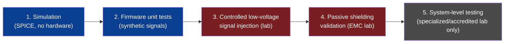

# Test Procedures

**Author:** Ciprian Ștefan Pleșca

## General principle

Testing proceeds in stages, from software simulation to hardware validation in an accredited laboratory. Testing with high-power EMP sources outside a specialized, authorized laboratory equipped with adequate shielding is **not recommended and not described here**.



## 1. Simulation (no hardware)

- Run the model in [`simulation/spice/emp_pulse_sim.sp`](../simulation/spice/emp_pulse_sim.sp) with ngspice to validate the theoretical response of the signal-conditioning circuit.
- Adjust the pulse-source parameters (amplitude, rise time) to cover the scenarios in [`docs/threat_model.md`](threat_model.md).
- Verify component safety margins (maximum voltages at the ADC input, etc.).

## 2. Firmware unit testing

- Use the files in [`firmware/tests/`](../firmware/tests/) to validate the detection algorithm with synthetic signals (injected through mock functions, not real hardware).
- Verify: correct thresholds, hysteresis behavior, absence of false positives on "normal signal" datasets.

## 3. Controlled signal injection (lab, low voltage)

- Use a laboratory pulse generator (**not** a high-power EMP source) to inject controlled, small-to-medium amplitude transients directly into the conditioning circuit's input.
- Measure the actual detection → actuator-activation time, using an oscilloscope with sufficient bandwidth.
- Document the results against the target values in [`docs/hardware_specs.md`](hardware_specs.md).

## 4. Passive shielding validation

- Measure the enclosure's attenuation using EMC test equipment (signal generator + transmit antenna + receive antenna inside), in an anechoic chamber or through an accredited laboratory.
- Compare results against the stated target (> 80 dB) over the relevant frequency range.

## 5. System-level testing (specialized lab, optional)

- Testing at energy levels representative of a real EMP event must be performed **exclusively** in specialized facilities authorized for this type of testing (e.g., EMC/EMP laboratories accredited to IEC 61000-4-25 or an equivalent military standard).
- This project does not provide, and will not provide, instructions for building a high-power test source.

## Test report template

```
Test date:
Hardware configuration:
Injected signal parameters:
Measured reaction time:
Result (PASS/FAIL vs. target):
Observations:
```
