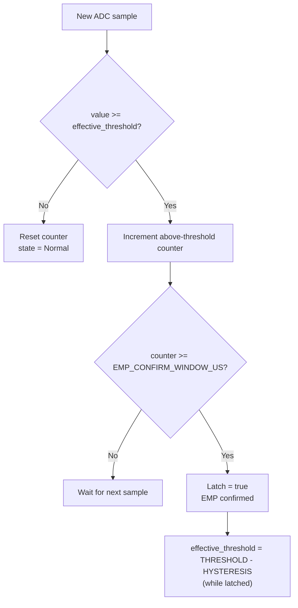

# Theory of Operation

**Author:** Ciprian Ștefan Pleșca

## What an "EMP event" means from a protection system's perspective

From this system's point of view, an "EMP" is any electromagnetic transient with:

- amplitude above a configurable threshold,
- a very short rise time (on the order of nanoseconds to microseconds),
- broad spectral content (from kHz up to hundreds of MHz or GHz, depending on the source).

The system does not attempt to identify the event's *cause* (natural or not) — it treats any transient exceeding the criteria as a threat and reacts.

## Why a decision algorithm is needed, not just a simple threshold

A simple voltage comparator would false-trigger on:

- switching of large industrial loads,
- minor electrostatic discharges,
- local radio interference (radio stations, radar, mobile telephony).

That's why the detection algorithm combines:

1. **Amplitude threshold** — the minimum signal level.
2. **Time window** — the minimum/maximum duration the signal must stay above threshold.
3. **Rate of rise (dV/dt)** — how steep the signal edge is; EMP events have much faster edges than ordinary industrial switching.
4. **Hysteresis** — to avoid rapid oscillation between "active"/"inactive" states around the threshold.

## System latency

The total time budget (target: under 10 µs from event onset to full shielding activation) is broken down approximately as follows:

| Stage | Estimated time |
|---|---|
| Signal propagation through conditioning circuit | ~0.5–1 µs |
| ADC sampling | ~0.4–1 µs at 1–2.4 MSPS |
| Decision algorithm evaluation (firmware) | ~1–3 µs |
| Actuator switching (MOSFET/IGBT) | ~1–5 µs |

These values are indicative and must be experimentally validated for each concrete hardware implementation — see [`docs/test_procedures.md`](test_procedures.md).

## Known limitations

- The system protects equipment inside the shielded enclosure; it cannot protect equipment located outside of it.
- An extremely intense EMP event occurring before the system reaches its protected state can still cause partial damage — this is why the project also recommends permanent passive shielding (a Faraday cage) as the first line of defense, with the active system as a supplement, not a replacement.
- Reaction time depends heavily on sensor and conditioning-circuit quality; the values in this document are theoretical.
