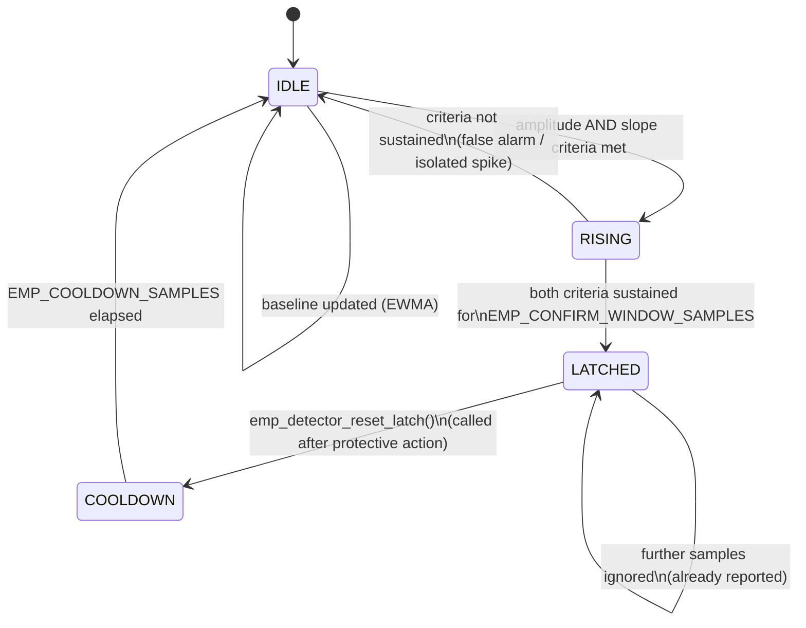

# Theory of Operation

**Author:** Ciprian Ștefan Pleșca

## What an "EMP event" means from a protection system's perspective

From this system's point of view, an "EMP" is any electromagnetic transient with:

- amplitude significantly above the current ambient noise floor,
- a very fast rise time (on the order of nanoseconds to microseconds),
- broad spectral content (from kHz up to hundreds of MHz or GHz, depending on the source).

The system does not attempt to identify the event's *cause* (natural or not) — it treats any transient satisfying the criteria below as a threat and reacts.

## Why amplitude alone is not enough

A simple fixed-voltage comparator would false-trigger on ordinary events that share one property with a real EMP transient — a high peak amplitude — but not the other: a fast rise time. In particular:

- switching of large industrial loads (high amplitude, but a rise time of milliseconds, not nanoseconds),
- minor electrostatic discharges,
- local radio interference (radio stations, radar, mobile telephony).

This matters physically, not just as a filtering convenience: the voltage induced in any coupling loop (a cable run, a PCB trace) is proportional to **dB/dt** — the *rate of change* of the field — not to its peak amplitude alone (see `V(t) = −A·dB/dt` in the project wiki, page "Physics and Waveforms"). A slow-rising signal, however large its eventual amplitude, induces far less transient stress on downstream electronics than a fast one. Treating amplitude as the only criterion would therefore both over-trigger on harmless slow events and mischaracterize what actually makes an EMP transient dangerous.

## The v2 detection algorithm: two independent criteria

The firmware (`firmware/src/emp_detector.c`) evaluates two criteria on every sample, and requires **both** to be satisfied, sustained over a short confirmation window, before declaring an event:

1. **Amplitude criterion** — the sample exceeds an *adaptively tracked* noise baseline by a configurable margin (`EMP_ADAPTIVE_MARGIN_ADC`), rather than a fixed absolute ADC value. The baseline is updated continuously via an exponentially weighted moving average (EWMA) while the detector is idle, so the detector remains well-calibrated even as ambient noise conditions drift slowly over time (e.g. with temperature, or a change in nearby equipment).

2. **Rate-of-rise criterion** — the absolute difference between consecutive samples exceeds a configurable slope threshold (`EMP_SLOPE_THRESHOLD_ADC`). This is what actually distinguishes a fast transient from slow industrial switching noise of comparable amplitude.

Both criteria must hold for `EMP_CONFIRM_WINDOW_SAMPLES` consecutive samples before the event is confirmed — this rejects single-sample spikes (isolated noise) that momentarily satisfy both criteria by chance.

### Why a cooldown state exists

Once an event is confirmed and the shield actuator has been engaged, the detector deliberately stops evaluating new events (`LATCHED` state) until the system explicitly calls `emp_detector_reset_latch()` — normally right after `shield_control_wait_reset()` completes in the main loop. Re-arming then passes through a `COOLDOWN` period rather than immediately resuming detection: this gives the adaptive baseline a chance to re-stabilize on genuinely quiet conditions before the amplitude/slope criteria resume evaluating samples, preventing the detector from immediately re-triggering on residual ringing or transients related to the just-handled event.

### Why the baseline only updates in the IDLE state

The EWMA baseline is deliberately *not* updated while a candidate or confirmed event is in progress. If it were, a sustained real event would gradually be "learned" as the new normal, raising the effective threshold and suppressing detection of the very event that is happening — the opposite of the intended behavior.

## System latency

The total time budget (target: under 10 µs from event onset to full shielding activation) is broken down approximately as follows:

| Stage | Estimated time |
|---|---|
| Signal propagation through conditioning circuit | ~0.5–1 µs |
| ADC sampling | ~0.4–1 µs at 1–2.4 MSPS |
| Decision algorithm evaluation (firmware, both criteria + state machine) | ~1–4 µs |
| Actuator switching (MOSFET/IGBT) | ~1–5 µs |

These values are indicative and must be experimentally validated for each concrete hardware implementation — see [`docs/test_procedures.md`](test_procedures.md). The v2 algorithm's extra per-sample work (slope computation, EWMA update) is a small, fixed number of integer operations and should not materially change the decision-latency budget versus a simpler threshold check, but this assumption itself belongs on the list of things to validate experimentally, not to assume.

## Known limitations

- The system protects equipment inside the shielded enclosure; it cannot protect equipment located outside of it.
- An extremely intense EMP event occurring before the system reaches its protected state can still cause partial damage — this is why the project also recommends permanent passive shielding (a Faraday cage) as the first line of defense, with the active system as a supplement, not a replacement.
- Reaction time depends heavily on sensor and conditioning-circuit quality; the values in this document are theoretical.
- The dual-criterion algorithm reduces, but does not eliminate, false positives: a sufficiently fast *and* sufficiently large legitimate transient (e.g. a nearby lightning-induced surge) can still satisfy both criteria. This is arguably correct behavior — such an event genuinely warrants a protective response — but it means the detector should not be assumed to be "EMP-specific" without further classification logic, which is explicitly out of scope for the current version (see `MANIFESTO.md`).
- The slope and margin constants (`EMP_SLOPE_THRESHOLD_ADC`, `EMP_ADAPTIVE_MARGIN_ADC`) are design-time defaults, not values derived from calibration on real hardware — they must be tuned per sensor and per installation.
